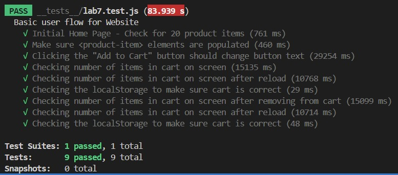

Aarav Vidhawan  

[Store Webapp](https://cse110-sp25.github.io/CSE110-Shop/)

[Local link](http://127.0.0.1:5500/src/index.html)

Test Results:

Difference Between Navigation and Snapshot:

Navigation mode performs a full page load from scratch (capturing load-time metrics), whereas Snapshot mode inspects the page as-is without reloading. Navigation reports timing metrics like First Contentful Paint and Time to Interactive; Snapshot skips load timings and focuses on audits (accessibility, SEO, best practices) of the existing DOM. Navigation is for measuring and optimizing initial load performance; Snapshot is for checking the structure and accessibility of the UI in its current, possibly post-interaction, state.

Three ways to Improve the CSE 110 Shop:

* Use image formats like WebP and AVIF over PNG and JPEG as they provide better compression +> faster downloads.
* Add long-term Cache-Control headers for static assets (images, CSS, JS) so repeat visitors see near-instant load times and reduced network traffic.
* Move critical CSS inline or defer non-critical styles and JavaScript so that the browser can paint content faster (improves FCP and Speed Index).